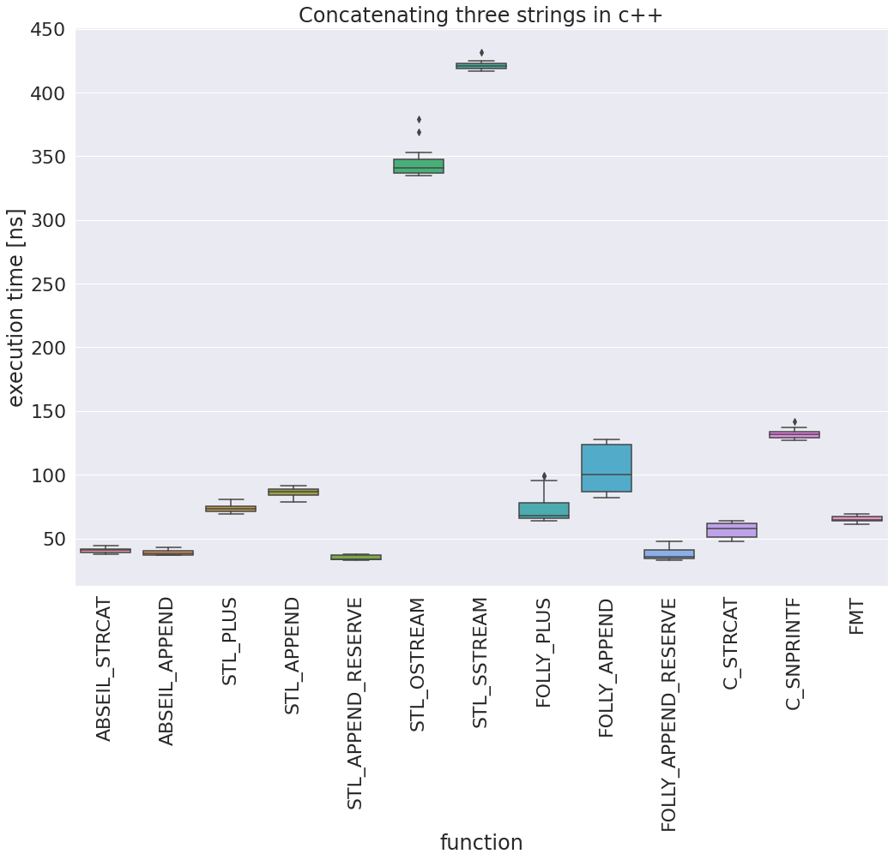

# strcat bench

benchmarking different possibilities to concat strings

Install folly: https://github.com/facebook/folly
To turn off CPU frequency scaling I used:  
```
sudo cpupower frequency-set --governor performance  
```


```
pip install conan  
mkdir build && cd build  
conan install .. --build=missing  
cmake ..  
./build/bin/strcat_bench --benchmark_repetitions=10 --benchmark_display_aggregates_only=false --benchmark_format=csv > str_bench.csv
```

For analyzing and plotting i used Jupyter Lab, Pandas, and Seaborn:
```
jupyter lab analyze_benchmark.ipynb 
```



Turn on frequency scaling again:   
```
sudo cpupower frequency-set --governor powersave
```


